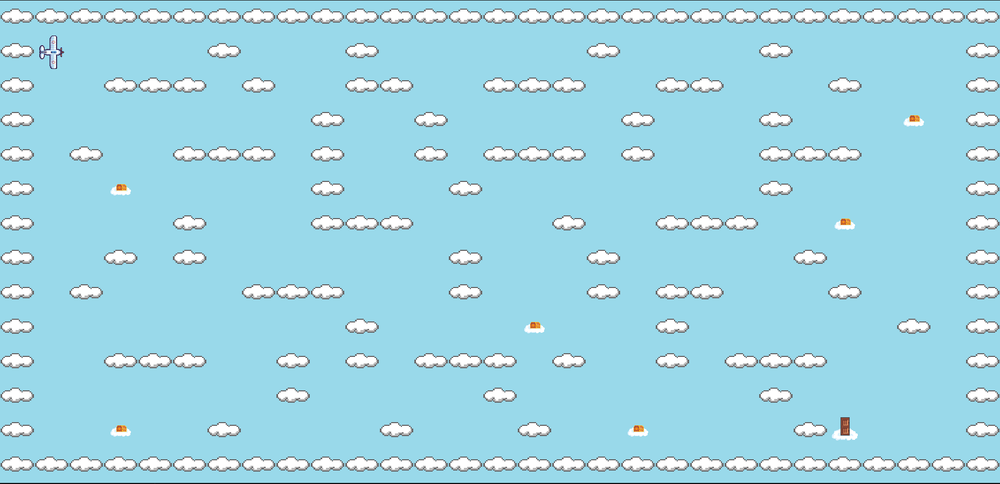

# so_long

 
[🇬🇧 English](./README_EN.md)
- [so\_long](#so_long)
	- [Description](#description)
	- [Instructions](#instructions)
		- [Obligatoire](#obligatoire)
		- [Bonus](#bonus)
	- [Commandes](#commandes)
	- [Cartes](#cartes)
	- [Bonus](#bonus-1)
	- [Utilisation de l’IA](#utilisation-de-lia)
	- [Ressources](#ressources)

## Description
Un projet graphique axé sur la création d’un petit jeu 2D en utilisant la bibliothèque MiniLibX. L’objectif est d’implémenter l’analyse de la carte, la logique de collision, le rendu des sprites et la gestion des événements, tout en respectant un ensemble strict de règles concernant la validité de la carte, les contraintes de déplacement et la gestion des ressources graphiques. La difficulté augmente avec la nécessité de créer des interactions fluides avec le joueur, de gérer les cycles d’animation et d’assurer un nettoyage correct des ressources. Ce projet permet de développer des compétences en graphismes bas niveau, programmation événementielle, gestion des entrées utilisateur, analyse de fichiers et gestion de la mémoire/des ressources dans un environnement C contraint.

## Instructions
### Obligatoire
- Utilisez la commande `make` pour compiler le programme.
- Utilisez la commande `./so_long maps/<fichier_carte>.ber` pour lancer le jeu.
### Bonus
- Utilisez la commande `make bonus` pour compiler le programme avec les bonus.
- Utilisez la commande `./so_long maps/<fichier_carte>.ber` pour lancer le jeu.
- **(Bonus personnel)** Utilisez la commande `./so_long <W> <H> <C> <Nombre d'ennemis>` pour generer une carte.
  - W: Largeur de la carte.
  - H: Hauteur de la carte.
  - C: Nombre d'objets à collecter.

## Commandes
| Touche                 | Description de l’action      |
|------------------------|------------------------------|
| **W** / **↑ (Haut)**   | Se déplacer vers le haut     |
| **A** / **← (Gauche)** | Se déplacer vers la gauche   |
| **S** / **↓ (Bas)**    | Se déplacer vers le bas      |
| **D** / **→ (Droite)** | Se déplacer vers la droite   |
| **ÉCHAP**              | Quitter le jeu               |

## Cartes
Les cartes se trouvent dans le dossier `maps`. 
La carte doit respecter certaines règles :
- La carte doit être au format `.ber`.
- La carte ne peut être composée que des 5 caractères suivants :
	- **0** pour un espace vide,
	- **1** pour un mur,
	- **C** pour un objet à collecter,
	- **E** pour la sortie de la carte,
	- **P** pour la position de départ du joueur.
	- Pour le bonus, vous pouvez ajouter :
		- **H** pour la position d’un ennemi.
- Pour être valide, une carte doit contenir 1 sortie, 1 position de départ et au moins 1 objet à collecter.
- La carte doit être rectangulaire.
- La carte doit être entièrement entourée de murs.
- Il doit exister au moins un chemin possible entre le joueur, tous les objets à collecter et la sortie.

## Bonus
- [x] Faire perdre le joueur lorsqu’il touche une patrouille ennemie.
- [x] Ajouter des animations de sprites.
- [x] Afficher le compteur de déplacements directement à l’écran au lieu de l’écrire dans le terminal.

## Utilisation de l’IA
L’IA a été utilisée pour générer certaines images comme l’ennemi, le fond du compteur de mouvement, l’affiche de victoire et l’affiche de défaite.

## Ressources
- MiniLibx
- [libft](https://github.com/AlexisParder/42_Cursus/tree/main/libft)
- [pixilart](https://www.pixilart.com/)