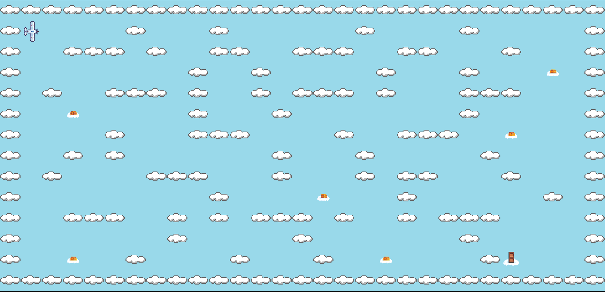

*This project has been created as part of the 42 curriculum by achauvie.*

# so_long

 
[🇫🇷 French](./README.md)
- [so\_long](#so_long)
	- [Description](#description)
	- [Instructions](#instructions)
		- [Mandatory](#mandatory)
		- [Bonus](#bonus)
	- [Controls](#controls)
	- [Maps](#maps)
	- [Bonus](#bonus-1)
	- [Use of AI](#use-of-ai)
	- [Resources](#resources)

## Description
A graphical project focused on building a small 2D game using the MiniLibX library. The objective is to implement map parsing, collision logic, sprite rendering, and event handling, while respecting a strict set of rules regarding map validity, movement constraints, and asset management. The challenge increases with the need to create smooth player interactions, handle animation cycles, and ensure proper resource cleanup. This project develops skills in low-level graphics, event-driven programming, input handling, file parsing, and memory/resource management within a constrained C environment.

## Instructions
### Mandatory
- Use the `make` command to compile the program.
- Use the `./so_long maps/<map_file>.ber` command to start game.
### Bonus
- Use the `make bonus` command to compile the program with bonus.
- Use the `./so_long maps/<map_file>.ber` command to start game.
- **(Personal bonus)** Use the command `./so_long_bonus <W> <H> <C> <Number_of_enemies>` to generate a map.
	- W: Map width.
	- H: Map height.
	- C: Number of collectible items.

## Controls
| Key                   | Action Description           |
|-----------------------|------------------------------|
| **W** / **↑ (Up)**    | Move up                      |
| **A** / **← (Left)**  | Move left                    |
| **S** / **↓ (Down)**  | Move down                    |
| **D** / **→ (Right)** | Move right                   |
| **ESCAPE**            | Quit game                    |

## Maps
The maps are located in the `maps` folder. 
The map must follow certain rules:
- The map must be in the `.ber` format.
- The map can be composed of only these 5 characters:
	- **0** for an empty space,
	- **1** for a wall,
	- **C** for a collectible,
	- **E** for a map exit,
	- **P** for the player’s starting position.
	- For the bonus, you can add
		- **H** for the position of an enemy
- To be valid, a map must contain 1 exit, 1 starting position and at least 1 collectible.
- The map must be rectangular.
- The map must be enclosed/surrounded by walls.
- There must be at least one possible path between the player, all the collectibles, and the exit door.

## Bonus
- [x] Make the player lose when they touch an enemy patrol.
- [x] Add some sprite animation.
- [x] Display the movement count directly on screen instead of writing it in the shell.

## Use of AI
AI was used to generate certain images such as the enemy, the movement counter background, the victory poster, and the defeat poster.

## Resources
- MiniLibx
- [libft](https://github.com/AlexisParder/42_Cursus/tree/main/libft)
- [pixilart](https://www.pixilart.com/)